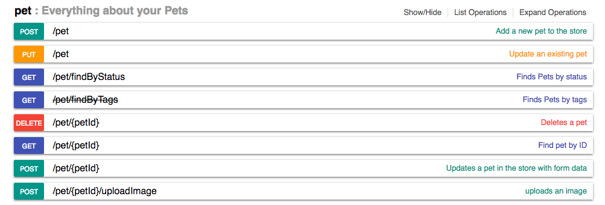
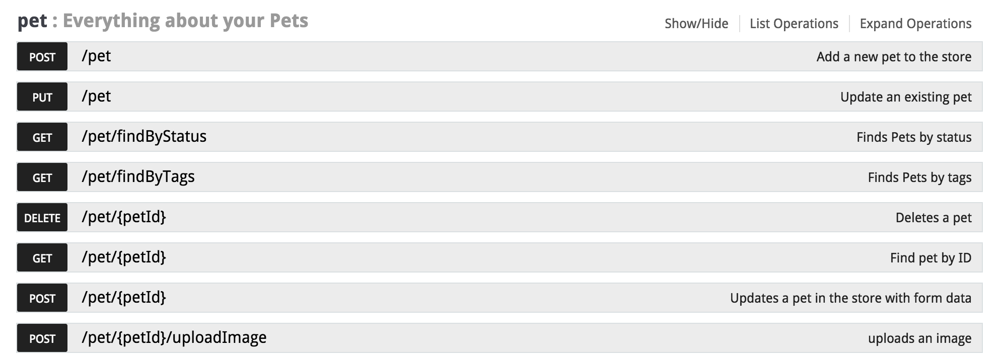
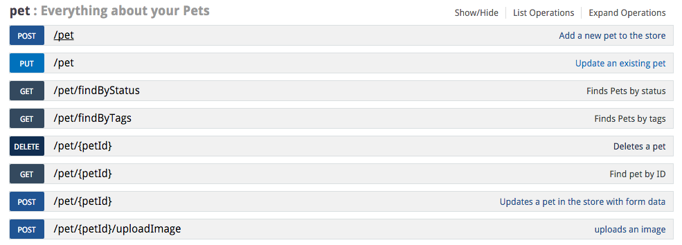

## Swagger UI Themes

*Version 2.1.0*

[](https://www.npmjs.com/package/swagger-ui-themes)
[](https://github.com/ostranme/swagger-ui-themes)

> Swagger Docs are awesome. Why not make them look better!


- Below is a collection of CSS themes for [Swagger UI](http://swagger.io/swagger-ui/).
- Get started at [http://meostrander.com/swagger-ui-themes/](http://meostrander.com/swagger-ui-themes/)

## Getting started

Download the swagger-ui-themes project and place the desired stylesheet into the source of your swagger-ui html.

In the `<head>` of your html, reference the location to your [theme].css

Make sure to either remove/comment out the link to `screen.css` or load the desired theme after to override the default Swagger UI styles.

```html
<link rel="stylesheet" href="path/to/swagger-ui-themes/css/theme-flattop.css">
```
#### Install with bower

```shell
$ bower install swagger-ui-themes
```

#### Install with npm

```shell
$ npm install swagger-ui-themes
```

## Themes

#### Material


#### Flattop


#### Muted


#### Newspaper


#### Outline


#### Monokai


#### Feeling Blue


## Contributing

If you want to add theme ideas or other fixes/changes, feel free to submit an issue.

#### Requesting new theme

- Title your new issue Theme request: theme-name (e.g., Theme request: theme-nyan-cat).
- Include a few use cases for your requested theme. How do you plan on using it?

## License

- Code licensed under [MIT License](http://opensource.org/licenses/mit-license.html)
