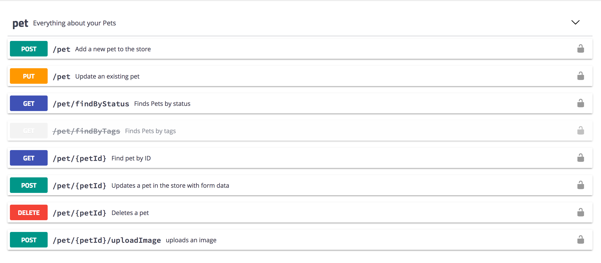
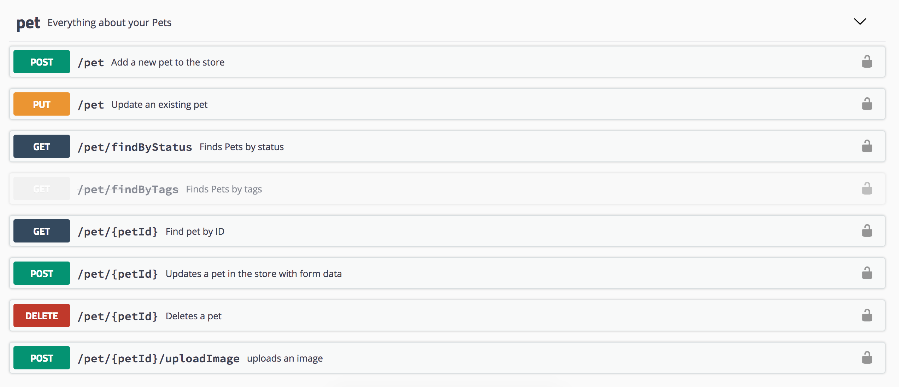
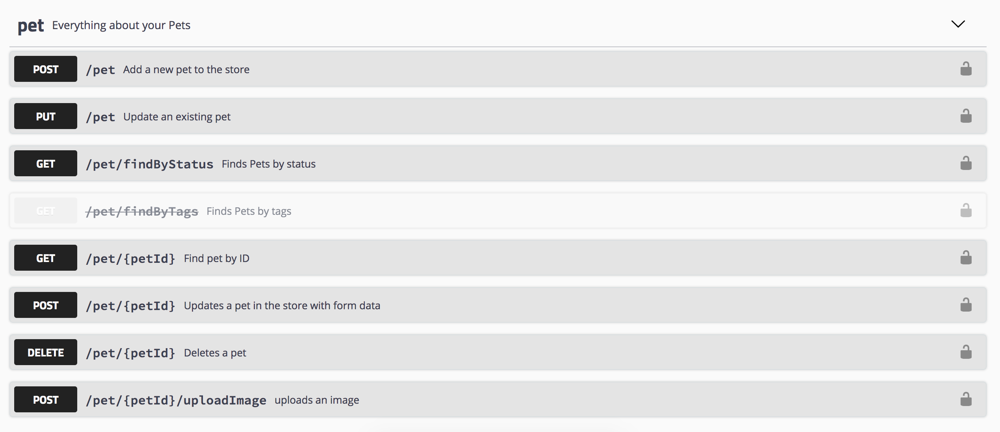
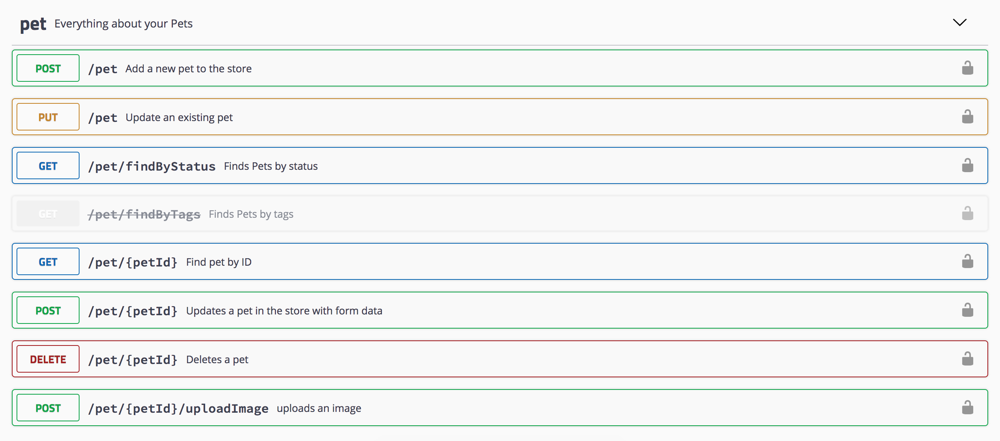
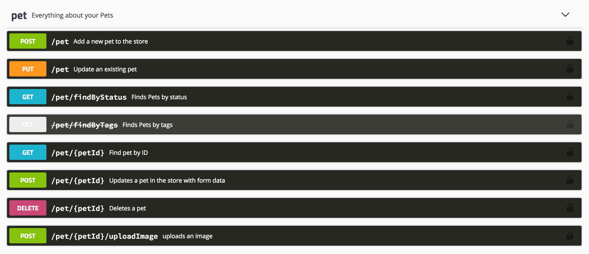
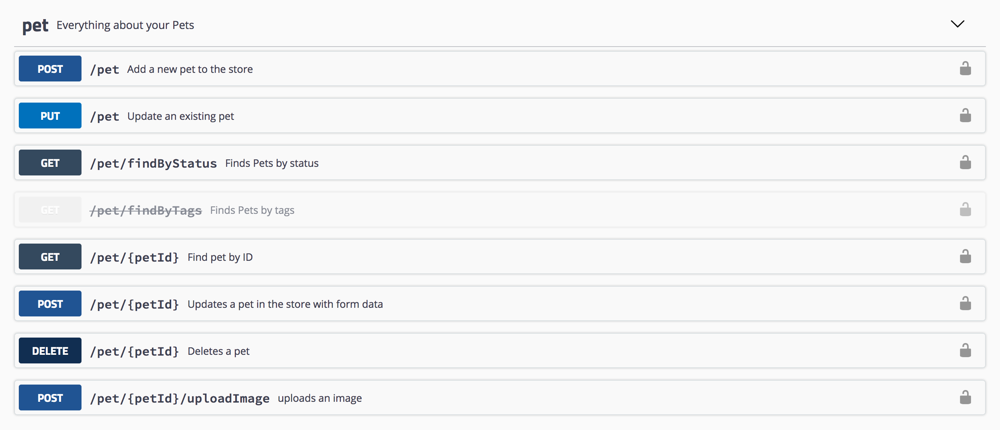

## Swagger UI Themes

*Version 3.0.1*

[](https://www.npmjs.com/package/swagger-ui-themes)
[](https://github.com/ostranme/swagger-ui-themes)

> Swagger Docs are awesome. Why not make them look better!


- Below is a collection of CSS themes for [Swagger UI](http://swagger.io/swagger-ui/).
- Get started at [http://ostranme.github.io/swagger-ui-themes/](http://ostranme.github.io/swagger-ui-themes/)

## Getting started

Download the swagger-ui-themes project and place the desired stylesheet into the source of your swagger-ui html. Use the `3.x` or `2.x` directories depending on what version of Swagger UI you have.

```
├── 2.x
│   ├── theme-feeling-blue.css
│   ├── theme-flattop.css
│   ├── theme-material.css
│   ├── theme-monokai.css
│   ├── theme-muted.css
│   ├── theme-newspaper.css
│   └── theme-outline.css
└── 3.x
    ├── theme-feeling-blue.css
    ├── theme-flattop.css
    ├── theme-material.css
    ├── theme-monokai.css
    ├── theme-muted.css
    ├── theme-newspaper.css
    └── theme-outline.css
```

In the `<head>` of your html, reference the location to your [theme].css

```html
<link rel="stylesheet" href="path/to/swagger-ui-themes/css/theme-flattop.css">
```

- For `3.x`, make sure to either remove/comment out the link to `swagger-ui.css` or load the desired theme after to override the default Swagger UI styles.

  > If you have issues loading themes with 3.x, try modifying the index.html to load the theme.css absolutely last right before the closing body or html tag.
  - [workaround] 3.x theme loading issue ([#25](https://github.com/ostranme/swagger-ui-themes/issues/28))

- For `2.x`, make sure to either remove/comment out the link to `screen.css` or load the desired theme after to override the default Swagger UI styles.

#### Install with bower

```shell
$ bower install swagger-ui-themes
```

#### Install with npm

```shell
$ npm install swagger-ui-themes
```

## 3.x Themes

#### Material


#### Flattop


#### Muted


#### Newspaper


#### Outline


#### Monokai


#### Feeling Blue


## 2.x Themes

#### Material


#### Flattop


#### Muted


#### Newspaper


#### Outline


#### Monokai


#### Feeling Blue


## Community Driven Tools

| Name | Description |
|------|-------------|
| [swagger-ui-themes-extensions](https://chrome.google.com/webstore/detail/swagger-ui-themes/mmbhchnmidfdfbecginjphmijieofngc) | Chrome extension to apply swagger-ui themes (https://github.com/AMoreaux/swagger-ui-themes-extension) |

## Contributing

If you want to add theme ideas or other fixes/changes, feel free to submit an issue.

#### Requesting new theme

- Title your new issue Theme request: theme-name (e.g., Theme request: theme-nyan-cat).
- Include a few use cases for your requested theme. How do you plan on using it?

## License

- Code licensed under [MIT License](http://opensource.org/licenses/mit-license.html)
